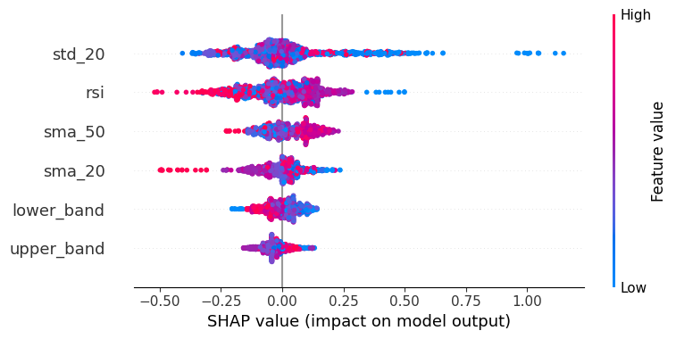

# 🚀 Institutional-Grade Quant Trading System (XGBoost)

[](https://www.python.org/)
[](https://www.docker.com/)
[](https://xgboost.readthedocs.io/)

A professional-grade, modular backtesting framework utilizing **XGBoost Machine Learning** for signal generation and **Volatility-Targeting Risk Management** for portfolio optimization.

## 📊 Key Results (Post-Friction)
> **Note:** Performance metrics below include a **15-basis point execution friction model** (Slippage + Commissions) to ensure real-world viability and institutional consistency.

* **Total Return:** 32.06%
* **Sharpe Ratio:** 0.36
* **Max Drawdown:** -23.18%
* **Validation Strategy:** Walk-Forward Analysis (252-day training / 21-day testing window)

---

## 🔬 Core Engineering Features

### 1. **Explainable AI (XAI) with SHAP**
Unlike traditional "Black Box" models, this system implements **SHAP (Shapley Additive Explanations)** to quantify the impact of specific technical indicators on the model's decision-making process. This provides full alpha transparency for risk committees and stakeholders.



### 2. **Financial Rigor & Market Friction**
Most retail backtests produce "phantom profits" by ignoring the cost of execution. This engine models the reality of the market through:
* **Transaction Costs:** 0.1% fixed commission per trade.
* **Slippage:** 0.05% price impact modeling to account for market liquidity and spread.

### 3. **Dynamic Risk Management**
The engine utilizes **Volatility-Targeting Position Sizing**. By scaling capital exposure inversely to market volatility, the system maintains a constant risk budget, smoothing the equity curve and protecting capital during high-stress regimes.

### 4. **Production-Ready Architecture**
* **Containerization:** Fully Dockerized environment to ensure "write once, run anywhere" reproducibility.
* **Reliability:** Integrated unit tests verifying drawdown logic, signal generation, and data integrity.
* **Modular Design:** Separate layers for data ingestion, signal modeling, and backtesting execution.

---

## 🛠️ Project Structure
```text
├── src/
│   ├── engine.py       # Backtest Engine with Friction & Risk Logic
│   ├── models.py       # XGBoost Strategy & Walk-Forward Logic
│   ├── data_fetcher.py # Robust Market Data Pipeline
├── research/
│   ├── final_report.py # Institutional Performance Analytics
│   ├── explainability.py # SHAP XAI Visualizations
├── tests/              # Unit Tests for logic verification
├── Dockerfile          # Production Environment Config
└── requirements.txt    # Dependency Management